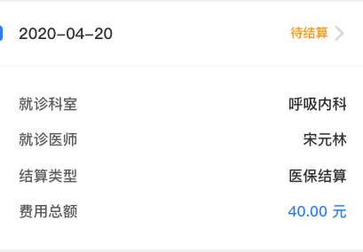

## 通用卡片容器

### 图片



### 如何使用

```javascript
import GCard from '@/components/GCard'

<g-card
  :title="title"
  :url="url"
  :data="list"
/>
```

### Props

| name  | 描述 | 默认值      | 类型   | 是否必需   |
| ----- | ---- | ----------- | ------ | ------ |
| data | 数据源 | [] | Array | false |
| title | 标题 | '' | String | false |
| icon | 标题图标 | 无 | String | false |
| url | 头部跳转路径 | '' | String | false | clickEvent为点击事件 不进行页面跳转（<g-card url="clickEvent" @clickEvent="clickEvent">）
| hasTitleActive | 是否需要左边蓝色小标志 | true | Boolean | false |
| hasMarginBottom | 是否显示底部边距 | true | Boolean | false |

### Slot

| 名字 | 描述 |
| ---- | ---- |
| headLeft | 头部左侧区块 |
| headRight | 头部右侧区块 |
| content | 内容区块 |

### Mock Data

```javascript
title = '2020-04-20'
url = '/demo'
list = [
  {
    name: '就诊科室',
    value: '呼吸内科'
  },
  {
    name: '就诊医师',
    value: '宋元林'
  },
  {
    name: '结算类型',
    value: '医保结算'
  },
  {
    name: '费用总额',
    value: '40.00 元',
    color: '#3186FF'
  }
]
```
