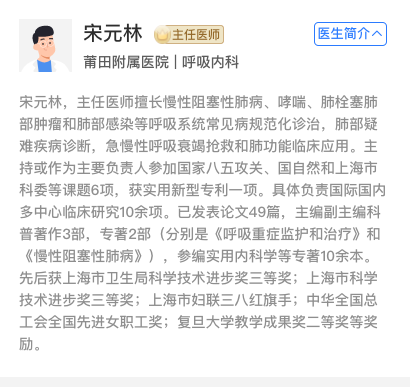

## 医生简介卡片

### 图片




### 如何使用

```javascript
import GDoctorCard from '@/components/GDoctorCard'

<g-doctor-card
  :name="doctorInfo.name"
  :level="doctorInfo.level"
  :hospital="doctorInfo.hospital"
  :department="doctorInfo.department"
  :content="doctorInfo.content"
/>
```

### Props

| name  | 描述 | 默认值 | 类型   | 是否必需 | 备注 |
| ------ | ------ | ------ | ------ | ------ | ------ |
| name | 姓名 | '' | String | false | 无 |
| gender | 性别 | '男' | String/Number | false | 男性：男，1，'1' 女性：女，2，'2'|
| avatar | 头像地址 | '' | String | false | 为链接地址，会根据性别展示默认头像 |
| level | 医生职称 | '' | String | false | 例如：主任医师 |
| hospital | 医院 | '' | String | false | 无 |
| department | 科室 | '' | String | false | 例如：院长 |
| content | 简介内容 | '' | String | false | 无 |
| hasMarginBottom | 是否有底部 20px 的底部边距 | true | Boolean | false | 无 |
| avatarShape | 头像形状 | 'round' | String | false | round：圆形，cube：方形 |
| hasFolder | 是否有收起和展开简介 | true | Boolean | false | 无 |

### Slot

| 名字 | 描述 |
| ---- | ---- |
| 暂无 | 暂无 |

### Mock Data

``` js
doctorInfo = {
  name: '宋元林',
  level: '主任医师',
  hospital: '莆田学院附属医院',
  department: '呼吸内科',
  content: '宋元林，主任医师擅长慢性阻塞性肺病、哮喘、肺栓塞肺部肿瘤和肺部感染等呼吸系统常见病规范化诊治，肺部疑难疾病诊断，急慢性呼吸衰竭抢救和肺功能临床应用。主持或作为主要负责人参加国家八五攻关、国自然和上海市科委等课题6项，获实用新型专利一项。具体负责国际国内多中心临床研究10余项。已发表论文49篇，主编副主编科普著作3部，专著2部（分别是《呼吸重症监护和治疗》和《慢性阻塞性肺病》），参编实用内科学等专著10余本。先后获上海市卫生局科学技术进步奖三等奖；上海市科学技术进步奖三等奖；上海市妇联三八红旗手；中华全国总工会全国先进女职工奖；复旦大学教学成果奖二等奖等奖励。'
}
```
