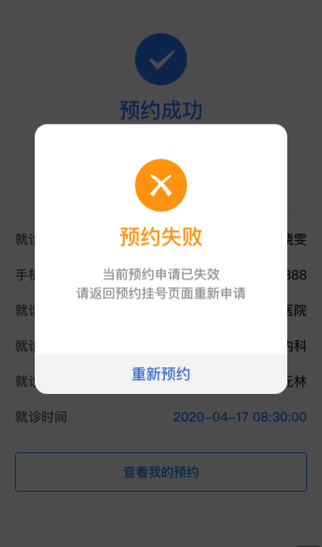

## 失败结果组件

### 图片



### 如何使用

```js
import GFailResult from '@/components/GFailResult'

<g-fail-result
  :title="title"
  :subTitle="subTitle"
  :url="url"
  :urlText="urlText"
/>
```

### Props

| name  | 描述 | 默认值      | 类型   | 是否必需   |
| ----- | ---- | ----------- | ------ | ------ |
| title | 标题 | '' | String | false |
| subTitle | 副标题 | '' | String | false |
| url | 底部按钮跳转链接 | '' | String | true |
| urlText | 底部按钮文案 | '' | String | true |

### Slot

| 名字 | 描述 |
| ---- | ---- |
| 暂无 | 暂无 |

### Mock Data

``` js
title = '预约失败',
subTitle = '当前预约申请已失效<br>请返回预约挂号页面重新申请',
url = '/demo',
urlText = '查看我的预约',
```