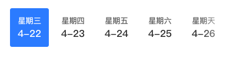

## 横向滚动栏

### 图片



### 如何使用

```js
import GHorizontalScroller from '@/components/GHorizontalScroller'

<g-horizontal-scroller
  :current="currentTime"
  :data="dateArray"
  @tabChange="scrollerChange"
/>
```

### Props

| name  | 描述 | 默认值      | 类型   | 是否必需 |
| ----- | ---- | ----------- | ------ | ------ |
| current | 当前数据值 value | '' | String | true |
| data | 数据源 | [] | Array | true |

### Slot

| 名字 | 描述 |
| ---- | ---- |

### Action

| 名字 | 描述 |
| ---- | ---- |
| tabChange | 切换时触发，返回当前数据 |

### Mock Data

```js
value: '4-22',
data: [
  {name: "星期三", value: "4-22"},
  {name: "星期四", value: "4-23"}
  {name: "星期五", value: "4-24"}
  {name: "星期六", value: "4-25"}
  {name: "星期天", value: "4-26"}
  {name: "星期一", value: "4-27"}
  {name: "星期二", value: "4-28"}
  {name: "星期三", value: "4-29"}
  {name: "星期四", value: "4-30"}
]
```
