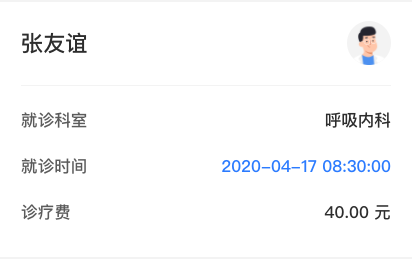

## 信息卡片

### 图片

详情版：


精简版：


### 如何使用

```javascript
import GInfoCard from '@/components/GInfoCard'

<g-info-card
  :title="title"
  :subTitle="subTitle"
  :thirdTitle="thirdTitle"
  :data="list"
/>
```

### Props

| name  | 描述 | 默认值      | 类型   | 是否必需 |
| ----- | ---- | ----------- | ------ |
| title | 标题 | '' | String | false |
| subTitle | 副标题 | '' | String | false |
| thirdTitle | 第三标题 | '' | String | false |
| avatar | 头像地址 | '' | String | false |
| data | 数据源，数据格式见下 | '' | Array | false |
| hasMarginBottom | 是否需要底部 20px 间距 | '' | Boolean |
| hasAvatar | 是否需要头像 | true | Boolean |

### Slot

| 名字 | 描述 |
| ---- | ---- |
| content | 内容 |

### Mock Data

```javascript
title = '张友谊',
list = [
  {
    name: '就诊科室',
    value: '呼吸内科'
  },
  {
    name: '就诊时间',
    value: '2020-04-17 08:30:00',
    color: '#3186FF' // 若需要设置颜色，需要带上 color 属性
  },
  {
    name: '诊疗费',
    value: '40.00 元'
  }
]
```
