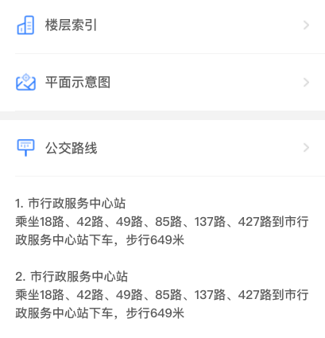

## 通用列表卡片

### 图片



### 如何使用

```javascript
import GListCard from '@/components/GListCard'

<g-list-card
  :data="list"
/>
```

### Props

| name  | 描述 | 默认值      | 类型   |  备注  |
| ----- | ---- | ----------- | ------ | ----|
| data | 列表数据 | [] | Array | 单个数据格式见下面模拟数据 |

### Slot

| 名字 | 描述 |
| ---- | ---- |
| content | 内容区 |

### 模拟数据

```javascript
list = [
  {
    name: '楼层索引',
    value: 'ssss',
    url: 'ssss',
    icon: 'iconSrc'
  },
  {
    name: '平面示意图',
    value: 'ssss',
    url: 'ssss',
    icon: 'iconSrc'
  }
]
```