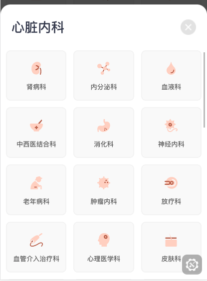

## 底部弹窗

### 图片



### 如何使用

```js
import GPopup from '@/components/GPopup'
<g-popup
  :visible.sync="popShow"
  :title="title"
>
  <template slot="content"></template>
</g-popup>
```

### Props

| name  | 描述 | 默认值      | 类型   | 是否必需 |
| ----- | ---- | ----------- | ------ | ------ |
| title | 标题 | '' | String | false |
| content | 弹窗内容 | '' | String | false |
| height | 弹窗高度 | '75%' | String | false |
| visible | 是否显示 | false | Boolean | true |
| position | 弹出位置 | 'bottom' | String | false |

### Slot

| 名字 | 描述 |
| ---- | ---- |
| content | 弹窗内容 |
