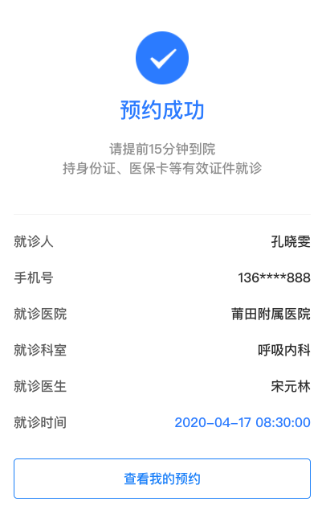

## 成功结果组件

### 图片



### 如何使用

```js
import GSuccessResult from '@/components/GSuccessResult'

<g-success-result
  :title="title"
  :subTitle="subTitle"
  :url="url"
  :urlText="urlText"
  :data="data"
/>
```

### Props

| name  | 描述 | 默认值      | 类型   | 是否必需   |
| ----- | ---- | ----------- | ------ | ------ |
| title | 标题 | '' | String | false |
| subTitle | 副标题 | '' | String | false |
| url | 底部按钮跳转链接 | '' | String | false |
| urlText | 底部按钮文案 | '' | String | false |
| data | 数据源 | [] | Array | false |

### Slot

| 名字 | 描述 |
| ---- | ---- |
| 暂无 | 暂无 |

### Mock Data

``` js
title = '预约成功',
subTitle = '请提前15分钟到院<br>持身份证、医保卡等有效证件就诊',
url = '/demo',
urlText = '查看我的预约',
data = [
  {
    name: '就诊人',
    value: '孔晓雯'
  },
  {
    name: '手机号',
    value: '136****888'
  },
  {
    name: '就诊医院',
    value: '莆田学院附属医院'
  },
  {
    name: '就诊科室',
    value: '呼吸内科'
  },
  {
    name: '就诊医生',
    value: '宋元林'
  },
  {
    name: '就诊时间',
    value: '2020-04-17 08:30:00',
    color: '#3186FF'
  }
]
```